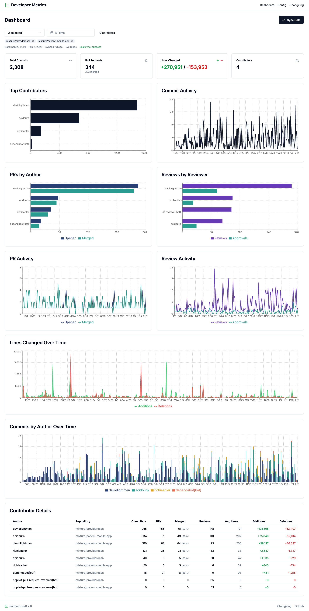

# devmetrics

A local-first dashboard for tracking development metrics from GitHub repositories. Visualize commits, pull requests, reviews, and contributor activity across your repos.



## Why I built this

I built devmetrics because I needed a lightweight way to understand engineering activity across GitHub repositories. The goal isn’t a single “productivity score,” but a clear set of signals (PR flow, review load, contribution trends) that are easy to scan and discuss with my teams.

I tried several existing tools, but I kept running into tradeoffs: decent data but missing key metrics, poor UX, JSON data only with no visualizations, or Java-based tools that required installing a local JDK which I wasn't keen on. So, I decided to just build my own tool.

devmetrics focuses on metrics that are straightforward to fetch from the GitHub API and presents them in a clean dashboard you can run locally. It has been immediately useful for me, and I hope may be useful for others.

## Features

- **Commit Tracking**: View commit counts, additions/deletions per contributor
- **PR Analytics**: Track opened, merged PRs and merge rates
- **Review Metrics**: See who's doing code reviews and approvals
- **Activity Charts**: Visualize contribution patterns over time
- **Multi-repo Support**: Track multiple repositories in one dashboard
- **Incremental Sync**: Only fetch new data after initial sync
- **Filter & Explore**: Filter by date range or specific repositories
- **Local Storage**: All data stored locally in SQLite - your data stays on your machine

## Prerequisites

- [Node.js](https://nodejs.org/) 18+
- [Yarn](https://yarnpkg.com/) package manager
- A GitHub account with a Personal Access Token

## Quick Start

### 1. Clone the repository

```bash
git clone https://github.com/jayhung/devmetrics.git
cd devmetrics
```

### 2. Install dependencies

```bash
yarn install
```

### 3. Set up your GitHub token

Copy the example environment file:

```bash
cp .env.local.example .env.local
```

Edit `.env.local` and add your GitHub Personal Access Token:

```bash
GITHUB_TOKEN=ghp_your_token_here
```

#### Creating a GitHub Token

1. Go to [GitHub Settings > Tokens](https://github.com/settings/tokens)
2. Click **"Generate new token"** → **"Generate new token (classic)"**
3. Give it a descriptive name (e.g., "devmetrics dashboard")
4. Select the **`repo`** scope (full access to repositories)
5. Click **Generate token** and copy it

> **Note**: The `repo` scope is required to access commit history and PR data. For public repos only, the `public_repo` scope is sufficient.

### 4. Start the development server

```bash
yarn dev
```

Open [http://localhost:4000](http://localhost:4000) in your browser.

### 5. Add repositories and sync

1. Go to the **Config** page (`/config`)
2. Add repositories in `owner/repo` format (e.g., `facebook/react`)
3. Return to the Dashboard and click **Sync Data**

## Usage

### Adding Repositories

Navigate to `/config` and enter repositories in the format `owner/repo`. Examples:

- `facebook/react`
- `vercel/next.js`
- `your-org/your-private-repo`

### Syncing Data

Click the **Sync Data** button on the dashboard to fetch the latest data from GitHub. The first sync may take a while depending on repository size and history.

Subsequent syncs are incremental - only new commits and PRs since the last sync are fetched.

### Filtering

- **Repository filter**: Select specific repos to view
- **Date range**: Filter metrics to a specific time period
- Filters are persisted in local storage

### Rate Limits

The app respects GitHub API rate limits (5,000 requests/hour for authenticated users). The sync process:

- Shows current rate limit status before syncing
- Pauses if rate limit is too low
- Displays helpful messages if you hit the limit

## Project Structure

```
devmetrics/
├── src/
│   ├── app/              # Next.js app router pages
│   │   ├── api/          # API routes (metrics, repos, sync)
│   │   ├── config/       # Configuration page
│   │   └── page.tsx      # Main dashboard
│   ├── components/       # React components
│   │   ├── charts/       # Visualization components
│   │   └── ui/           # Reusable UI components
│   └── lib/              # Core logic
│       ├── db.ts         # SQLite database operations
│       ├── github.ts     # GitHub API client
│       └── metrics.ts    # Metrics calculations
├── data/                 # SQLite database (gitignored)
└── .env.local            # Environment variables (gitignored)
```

## Troubleshooting

### "Bad credentials" or authentication errors

- Verify your `GITHUB_TOKEN` is correct in `.env.local`
- Make sure the token hasn't expired
- Check the token has the `repo` scope

### "Rate limit exceeded"

- Wait for the rate limit to reset (shown in error message)
- For large syncs, consider syncing repos one at a time

### "Repository not found"

- Verify the repository exists and you have access to it
- For private repos, ensure your token has the `repo` scope
- Check the owner/repo format is correct

### Database errors

Delete the database to start fresh:

```bash
rm -rf data/
```

## Development

```bash
yarn dev          # Start dev server (port 4000)
yarn build        # Production build
yarn lint         # Run ESLint
```

## Tech Stack

- **Framework**: [Next.js](https://nextjs.org/) 16 with App Router
- **Language**: TypeScript
- **Database**: SQLite via [better-sqlite3](https://github.com/WiseLibs/better-sqlite3)
- **UI**: [Tailwind CSS](https://tailwindcss.com/) + [Radix UI](https://radix-ui.com/)
- **Charts**: [Recharts](https://recharts.org/)
- **GitHub API**: [@octokit/rest](https://github.com/octokit/rest.js)

## Changelog

See [CHANGELOG.md](CHANGELOG.md) for version history and release notes.

## License

MIT
